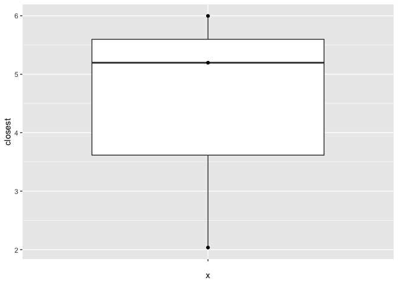
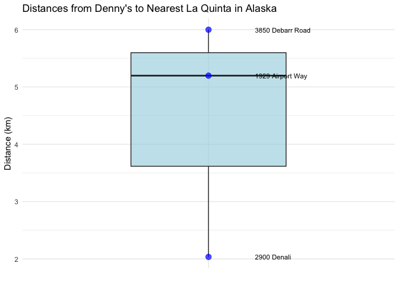

Lab 05 - La Quinta is Spanish for next to Denny’s, Pt. 2
================
Noah Booker
3/26/25

### Load packages and data

``` r
library(tidyverse) 
#library(dsbox) 
```

``` r
states <- read_csv("data/states.csv")
```

### Exercise 1

Filter the Denny’s data frame for Alaska (AK) and save the result as
dn_ak. How many Denny’s locations are there in Alaska?

``` r
load("~/Documents/Documents/Studies/School/WFU/DS4P/Lab_5/data/dennys.rda")
load("~/Documents/Documents/Studies/School/WFU/DS4P/Lab_5/data/laquinta.rda")
dn <- dennys
lq <- laquinta
dn_ak <- dn %>%
  filter(state == "AK")
nrow(dn_ak)
```

    ## [1] 3

There are three Denny’s locations in Alaska.

Now, do the same for La Quinta data frame for Alaska (AK) and save the
result as lq_ak. How many La Quinta locations are there in Alaska?

``` r
lq_ak <- lq %>% 
  filter(state == "AK")
nrow(lq_ak)
```

    ## [1] 2

There are two La Quinta locations in Alaska.

### Exercise 2

Next we will be calculating the distance between all Denny’s and all La
Quinta locations in Alaska.

How many pairings are there between all Denny’s and all La Quinta
locations in Alaska, i.e., how many distances do we need to calculate
between the locations of these establishments in Alaska?

3 x 2 = 6

Calculate the number of pairings using the data frames you have already
made.

``` r
#Why would I need code for this? dn has 2 observations, lq has 3. Number of pairings is 2 x 3 = 6.
```

### Exercise 3

In order to calculate these distances, we need to first restructure our
data to pair the Denny’s and La Quinta locations. To do so, we will join
the two data frames.

``` r
dn_lq_ak <- full_join(dn_ak, lq_ak, 
                      by = "state")
```

    ## Warning in full_join(dn_ak, lq_ak, by = "state"): Detected an unexpected many-to-many relationship between `x` and `y`.
    ## ℹ Row 1 of `x` matches multiple rows in `y`.
    ## ℹ Row 1 of `y` matches multiple rows in `x`.
    ## ℹ If a many-to-many relationship is expected, set `relationship =
    ##   "many-to-many"` to silence this warning.

``` r
dn_lq_ak
```

    ## # A tibble: 6 × 11
    ##   address.x     city.x state zip.x longitude.x latitude.x address.y city.y zip.y
    ##   <chr>         <chr>  <chr> <chr>       <dbl>      <dbl> <chr>     <chr>  <chr>
    ## 1 2900 Denali   Ancho… AK    99503       -150.       61.2 3501 Min… "\nAn… 99503
    ## 2 2900 Denali   Ancho… AK    99503       -150.       61.2 4920 Dal… "\nFa… 99709
    ## 3 3850 Debarr … Ancho… AK    99508       -150.       61.2 3501 Min… "\nAn… 99503
    ## 4 3850 Debarr … Ancho… AK    99508       -150.       61.2 4920 Dal… "\nFa… 99709
    ## 5 1929 Airport… Fairb… AK    99701       -148.       64.8 3501 Min… "\nAn… 99503
    ## 6 1929 Airport… Fairb… AK    99701       -148.       64.8 4920 Dal… "\nFa… 99709
    ## # ℹ 2 more variables: longitude.y <dbl>, latitude.y <dbl>

### Exercise 4

How many observations are in the joined dn_lq_ak data frame? What are
the names of the variables in this data frame?

We see in the tibble above that there are 6 observations on 11
variables. One variable, the one that was common between both datasets,
is state. The others are a .x and .y version of address, city, zip,
longitude, and latitude——the .x versions coming from the dn dataset,
indicating Denny’s locations, and the .y versions coming from the lq
dataset, indicating La Quinta locations.

### Exercise 5

What function from the tidyverse do we use to add a new variable to a
data frame while keeping the existing variables?

mutate( ).

``` r
haversine <- function(long1, lat1, long2, lat2, round = 3) {
  # convert to radians
  long1 <- long1 * pi / 180
  lat1 <- lat1 * pi / 180
  long2 <- long2 * pi / 180
  lat2 <- lat2 * pi / 180

  R <- 6371 # Earth mean radius in km

  a <- sin((lat2 - lat1) / 2)^2 + cos(lat1) * cos(lat2) * sin((long2 - long1) / 2)^2
  d <- R * 2 * asin(sqrt(a))

  return(round(d, round)) # distance in km
}
```

### Exercise 6

Calculate the distances between all pairs of Denny’s and La Quinta
locations and save this variable as distance. Make sure to save this
variable in THE dn_lq_ak data frame, so that you can use it later.

``` r
dn_lq_ak <- dn_lq_ak %>% 
  mutate(distance = haversine(longitude.x, latitude.x, longitude.y, latitude.y, round = 3))
```

### Exercise 7

Calculate the minimum distance between a Denny’s and La Quinta for each
Denny’s location. To do so we group by Denny’s locations and calculate a
new variable that stores the information for the minimum distance.

``` r
dn_lq_ak_mindist <- dn_lq_ak %>%
  group_by(address.x) %>%
  summarize(closest = min(distance))

dn_lq_ak_mindist
```

    ## # A tibble: 3 × 2
    ##   address.x        closest
    ##   <chr>              <dbl>
    ## 1 1929 Airport Way    5.20
    ## 2 2900 Denali         2.04
    ## 3 3850 Debarr Road    6.00

### Exercise 8

Describe the distribution of the distances of Denny’s and the nearest La
Quinta locations in Alaska. Also include an appropriate visualization
and relevant summary statistics.

Well, describing the distribution is pretty easy since there are only
three data points. There are three Denny’s locations with distances to
the nearest La Quinta of 5.20, 2.04, and 6 km.

``` r
dn_lq_ak_mindist %>% 
  ggplot(aes(x = "", y = closest)) +
  geom_boxplot() +
  geom_point()
```

<!-- -->

``` r
library(ggplot2)

# Create a box plot with labeled data points
ggplot(dn_lq_ak_mindist, aes(x = "", y = closest)) +
  geom_boxplot(width = 0.5, fill = "lightblue", alpha = 0.7) +
  geom_point(size = 3, color = "blue", alpha = 0.7) +
  # Add text labels for each point
  geom_text(aes(x = 1.15, label = address.x), hjust = 0, size = 3) +
  labs(title = "Distances from Denny's to Nearest La Quinta in Alaska",
       y = "Distance (km)",
       x = "") +
  theme_minimal() +
  theme(axis.text.x = element_blank(),
        axis.ticks.x = element_blank())
```

<!-- -->

Add exercise headings as needed.
